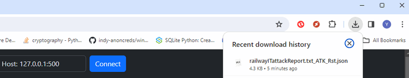

# Threats To MITRE(CWD,ATT&CK) Mapper

**Program Design Purpose**: we want to use the AI-LLM to help to process the human language threats scenario description document such as (technical blog, CTI report, cyber attack training notes ...) to summarize the attack flow path in the material, then

1. Parse the cyber attack behaviors from the attack and map each the single attack behaviors to the MITRE ATT&CK Matrix to find the related attack tactic and technique.   
2. Get the vulnerabilities in the threats descriptions and match the vulnerabilities  to the MITRE CWE. 

After finished the mapping and matching process the program will also automate generate the mapping and matching result report.


[TOC]

------

### Introduction

There are several threats analyze tools (integrated with MITRE-Attack Navigator ) in the market to help analyze the security threats report and such as [ThreatMapper](https://www.deepfence.io/threatmapper) and the [CRITs (Collaborative Research Into Threats)](https://crits.github.io/), but some of them need the user be familiar with 2 kind of  industry standards protocol STIX/TAXII : the user need to user the STIX (Structured Threat Information eXpression) to make the threats description accuracy and their service need to connect with TAXII (Trusted Automated Exchange of Indicator Information) for exchanging cyber threat intelligence which make the learning curve steep. 

We want to use the AI LLM to generate a prompt based tool/lib which can help analyze the human language threats scenario description document such as (technical blog, CTI report, cyber attack training notes ...) and automated generated the MITRE-ATT&CK Matrix mapping and MITRE-CWE Tree matching report. The tool will follow below steps to do the analyze : 

1. Summarize the material : We will use the AI LLM to analyze the long threats description material and summarize the attack scenario/ attack patch description. 

2. Parse the attack behaviors : We will input the threats summary to the LLM Attack behaviors analyzer to get the list of single element attack behaviors. 

3. Mapping the attack behaviors: every single element behavior will be mapping to the related technique in the MTIRE ATT&CK matrix

4. Result verification: we will use different AI LLM to verify whether the result can match to the original contents in threats material. 

5. Report generation: Based on the verified result, the program will generate the related mapping result for further research / development usage. 

   

Remark: the 5 steps analyze introduced in our program are an automation of the ( 6 steps ) introduced in the Threat Intelligence mapping example shown in the  MITRE-ATT&CK official document (page6 Example of FireEye report that’s been mapped to ATT&CK. ): 

https://www.mitre.org/sites/default/files/2021-11/getting-started-with-attack-october-2019.pdf


------

### Project Design 

On the MITRE-ATT&CK official document (page 6), there is an example to mapping the threats "FireEye" report to the MITRE ATT&CK Matrix (as shown below ) 


The document introduced 6 general steps to analyze the report which is not in the MITRE : 

1. Understand ATT&CK
2. Find the behavior
3. Research the behavior
4. Translate the behavior into a tactic 
5. Figure out what technique applies to the behavior
6. Compare your results to other analysts

Our program will use the LLM with the prompt engineering to automated the 6 steps to generate the mapping report. The program working flow is shown below: 


We will use the LLM ( module `LLM Attack Scenario Analyzer`) to analyze the human language threats scenario description source to generate a attack flow summary then Follow the below steps to map the threats to MITRE-ATT&CK or match to the MITRE-CWE

**For mapping to the MITRE-ATT&CK:**

- **Understand ATT&CK** : A MITRE-ATT&CK background knowledge prompt will  be passed to the LLM conversation chain to make the AI understand the make good of the task. 
- **Find the behavior**:  Module `LLM Attack behaviors analyzer` will go through the attack flow summary and get the list of single element attack behavior / action. 
- **Translate the behavior into a tactic** : Module `MITRE Tactic Mapper` will search the behaviors one by one to find the MITRE Matrix Tactic which can cover the attack action. 
- **Figure out what technique applies to the behavior**: Module `MITRE Technique Mapper`  will check the Techniques under the Tactic  to figure out what technique applies to the behavior. 
- **Result verification** :  After the Techniques, the Module `LLM Technique mapping Verifier` will map the Techniques to the original threat report to double confirm the correctness. 

**For Match to the MITRE-CWE:** 

- **Understand CWE**: A MITRE-CWE background knowledge prompt will  be passed to the LLM conversation chain to make the AI understand the make good of the task. 
- **Find the vulnerabilities**: Module `LLM Attack Scenario Vulnerabilities analyzer` will go thought the attack  flow summary and get the list of related vulnerabilities could be found from the description
- F**igure out what CWE includes the vulnerability**: Module `MITRE CWE Matcher` will check the vulnerabilities one by one to match to the closest weakness category in the MITRE CWE. 
-  **Result verification**: After get the CWE match result, the verifier module will compare the CWE to the original threats report to double confirm the correctness of match. 

Remark: The program will automated generate the analyze result report under JSON format, we allow the user to apply different AI modules on the verifier module to make the final result persuasive.


------

### Background Knowledge


#### MITRE CWE and ATT&CK

MITRE Common Weakness Enumeration (CWE) and MITRE ATT&CK (Adversarial Tactics, Techniques, and Common Knowledge) are two distinct frameworks developed by MITRE, each serving different purposes in the realm of cybersecurity:

- The CWE is category based frame work focuses on cataloging vulnerabilities and weaknesses (CVE). 
- The ATT&CK is knowledge based frame work focuses on documenting adversary behaviors and techniques (TTP).

The main difference and relationship between the MITRE CWE and ATT&CK is shown below:


##### MITRE CWE (Common Weakness Enumeration)

- CWE is a community-developed list of common software and hardware weaknesses, faults, and vulnerabilities.
- CWE provides a standardized taxonomy for categorizing and describing various types of security weaknesses that can lead to vulnerabilities in software and systems.
- Each CWE entry includes a unique identifier, a description of the weakness, examples, potential consequences, and mitigations.
- CWE is focused on identifying and classifying vulnerabilities and weaknesses to help organizations understand and address security issues in their software and systems.

##### MITRE ATT&CK (Adversarial Tactics, Techniques, and Common Knowledge)

- ATT&CK is a knowledge base maintained by MITRE that documents the tactics, techniques, and procedures (TTPs) used by adversaries during cyberattacks.
- ATT&CK provides a structured framework for understanding and categorizing adversary behaviors across the entire lifecycle of a cyberattack, from initial reconnaissance to data exfiltration.
- ATT&CK is organized into a matrix format, with tactics represented along the top row and techniques listed within each tactic.
- Each technique includes detailed information about how adversaries execute it, potential detection methods, and mitigations.
- ATT&CK is focused on understanding and defending against real-world cyber threats by mapping out the tactics and techniques used by adversaries.


#### Large Language Models

LLM (Large Language Models) prompt engineering refers to the process of crafting or designing input prompts to effectively elicit desired responses from language models like GPT (Generative Pre-trained Transformer). With LLMs, the prompt plays a crucial role in guiding the model to generate relevant and coherent outputs. Prompt engineering involves considering various factors such as the wording, structure, context, and task-specific instructions to optimize the performance of the model.

Effective prompt engineering can significantly influence the quality, relevance, and coherence of the generated text. It involves understanding the capabilities and limitations of the language model being used and tailoring the prompts accordingly to achieve specific goals, such as generating creative stories, answering questions, completing tasks, or providing relevant information.

This process often involves experimentation, iteration, and fine-tuning to find the most effective prompts for a given task or application. Prompt engineering is particularly important in applications such as natural language understanding, text generation, chatbots, and language-based AI systems, where the quality of the generated text directly impacts user experience and task performance.

In this program we use the language chain tool langchain https://www.langchain.com/langchain to build the continues conversation with the OpenAI-GPT4 and GPT-3.5 Turbo. If you want to use other LLM such as the google bard please refer to the langchain API document. 


------

### Program Usage/Execution

We provide two interface for user to use the program console command interface and web interface. Before use the program, please set your OpenAI keys in the configuration file `config.txt` :

```
# This is the config file template for the module <threats2MitreUtils.py>
# Setup the parameter with below format (every line follow <key>:<val> format, the
# key cannot be changed):

# set openAI API key
API_KEY:<openAI key>

# set the AI model apply to the mapper.
AI_MODEL:<GPT-4>

# set the AI model apply to the verifier, if not set program will use the same as the mapper.
VF_KEY:<openAI key>
AI_MODEL:<gpt-3.5-turbo-16k>

# Scneario Bank folder 
SCE_BANK:ScenarioBank
```


#### User the MITRE-Mapper From command line

Run the command interface program via command: 

```
python3 threats2MitreRun.py
```

Copy the threats description file to the `ScenarioBank` folder you set in the config file . 

Set the function and run the program as shown below: 


The report will be generated in the same folder : 

 


#### User the MITRE-Mapper From Web interface 

Run the command interface program via command: 

```
python3 threats2MitreRun.py
```

Open the browser and access the URL: http://127.0.0.1:5000/

Set up the mapper AI module and Verifier module , then upload the threats description file: 


Press the "Start" button


When the process finished, the report will auto download to your local download folder: 




------

> Last edit by LiuYuancheng(liu_yuan_cheng@hotmail.com) at 03/01/2024, , if you have any problem please free to message me.


